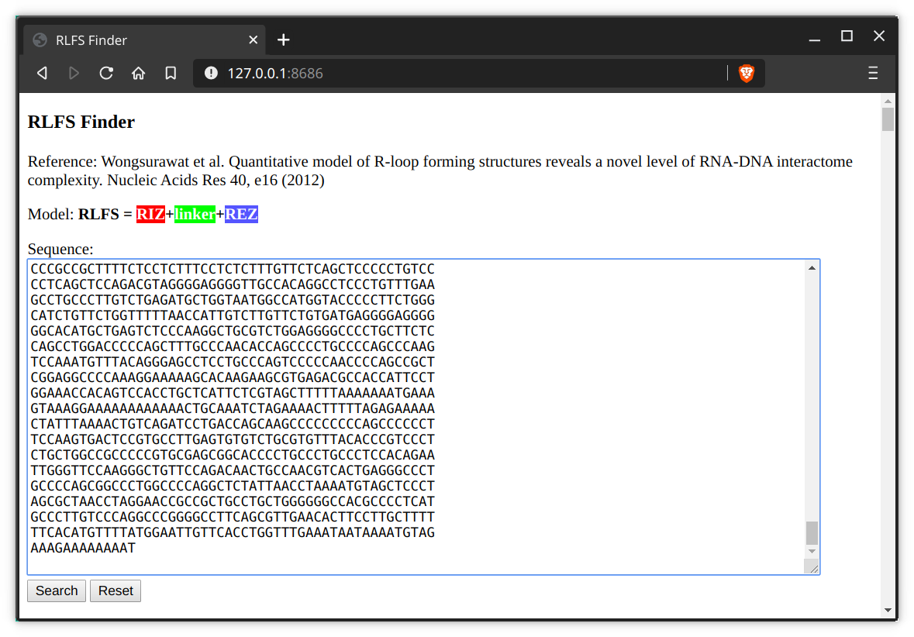
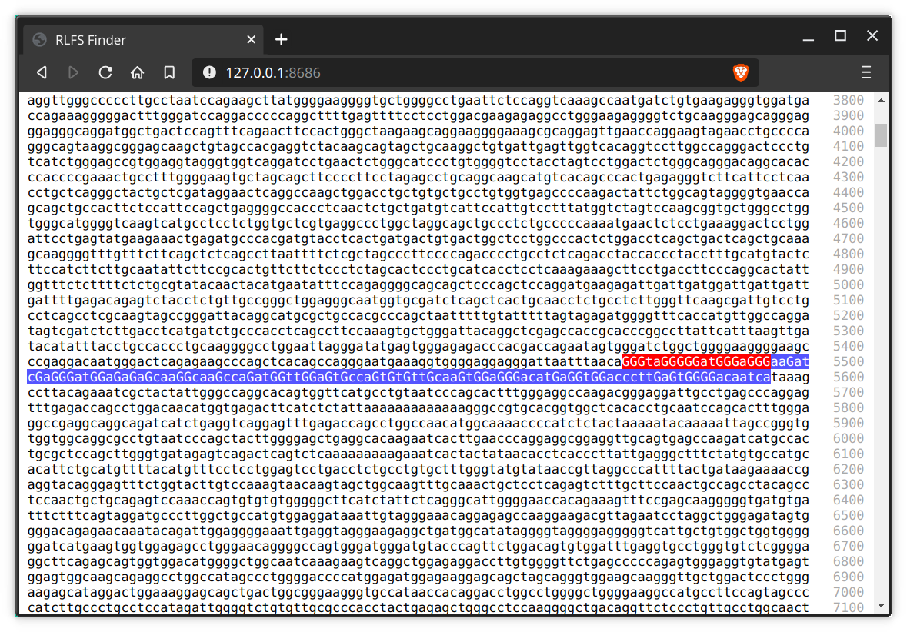

# rlfs-finder

A simple app to find RLFS, with web user interface and builtin web server.

```
RLFS = RIZ+linker+REZ
RIZ: GGGNGGGNGGG, each G cluster has at least 3 contiguous Gs, 1~2nt between clusters, at least three clusters
linker: 0~50nt
REZ: 100~2000nt, 40% G
```

[Reference](https://www.ncbi.nlm.nih.gov/pmc/articles/PMC3258121/): Wongsurawat et al. Quantitative model of R-loop forming structures reveals a novel level of RNA-DNA interactome complexity. Nucleic Acids Res 40, e16 (2012)



